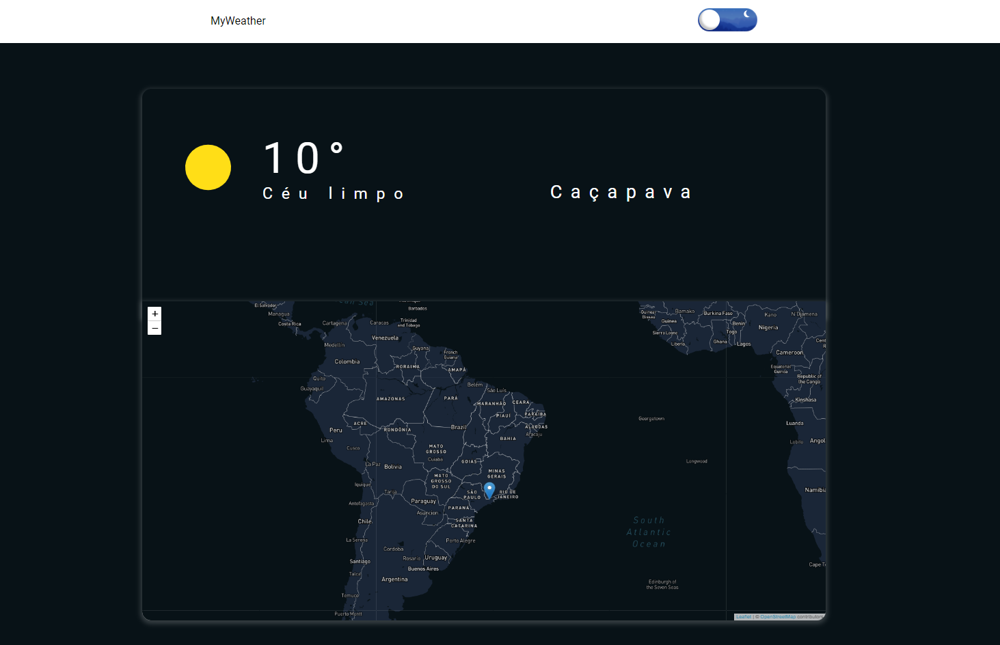

<p align="center">
  WeatherApp
</p>

<h1 align="center">
    
</h1>

<br>

## 🧪 Tecnologias

Esse projeto foi desenvolvido com as seguintes tecnologias:

- [React](https://reactjs.org)
- [React-Leaflet](https://react-leaflet.js.org/)
- [MapBox](https://www.mapbox.com/)
<br>

## 🚀 Como executar

Clone o projeto e acesse a pasta do mesmo.

```bash
$ git clone https://github.com/Joao1512/weatherApp.git
$ cd weatherApp
```

Para iniciá-lo, siga os passos abaixo:
```bash
# Instalar as dependências
$ yarn

# Iniciar o projeto
$ yarn start
```
O app estará disponível no seu browser pelo endereço http://localhost:3000.
